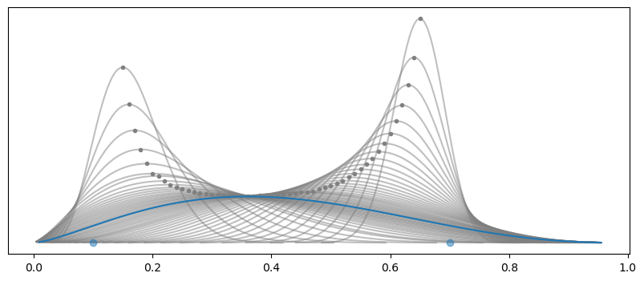
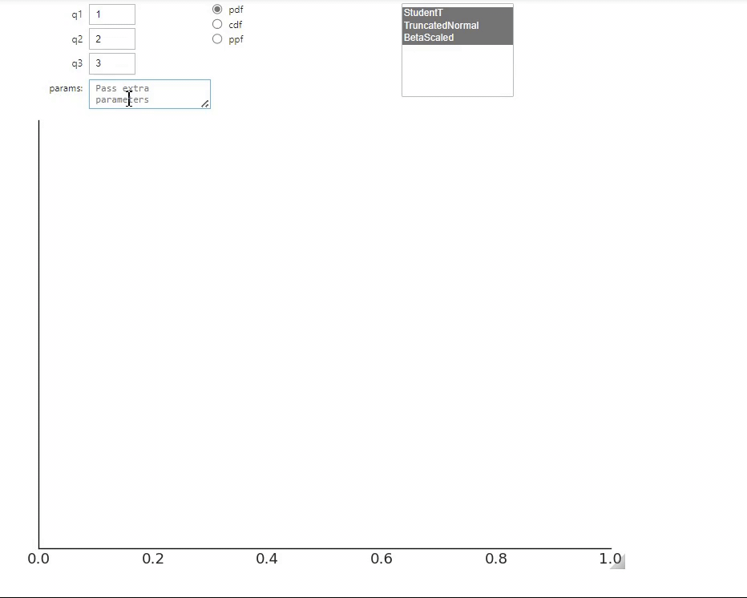
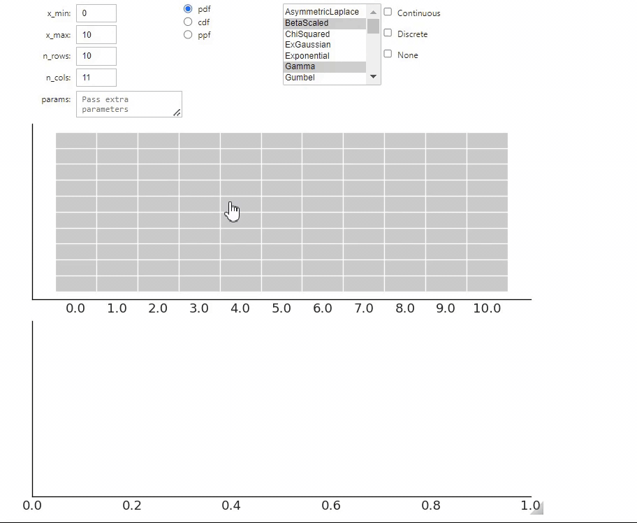

---
jupytext:
  text_representation:
    extension: .md
    format_name: myst
kernelspec:
  display_name: Python 3
  language: python
  name: python3
---
# Direct elicitation in 1D

```{jupyter-execute}

import matplotlib.pyplot as plt
import numpy as np

import preliz as pz
import pymc as pm
```

```{jupyter-execute}

pz.style.use("preliz-doc")
```

## From intervals to maximum entropy distributions

For some priors in a model, we may know or assume that most of the mass is within a certain interval. This information
is useful for determining a suitable prior, but this information alone may not be enough to obtain a unique set of
parameters. The following figure shows Beta distributions with 90% of the mass between 0.1 and 0.7, the dot represent
the mode of the distribution. As you can see even when all these distributions satisfies that restraint they convey very
different prior knowledge.



We can add one more condition, one that is very general. We can maximize the entropy. Given two distributions the one
with more entropy is the less informative one. Loosely speaking, is the most "spread" one. In the previous figure, the
blue line is the one with more entropy. Having priors with maximum entropy makes sense as this guarantees that we have
the less informative distribution, given a set of constraints.

In PreliZ we can compute maximum entropy priors using the function `maxent`. The first argument is a PreliZ
distribution.

```{jupyter-execute}

pz.maxent(pz.Beta(), lower=0.3, upper=0.8, mass=0.6)
pz.maxent(pz.Normal(), lower=0.3, upper=0.8, mass=0.6);
```

Usually, we pass uninitialized distribution to `maxent`. But we can also pass partially initialized distribution. This
is useful when we want to keep one or more parameters fixed. For instance, we may want to find a Gamma distribution with
a mean of 4 and with 90% of the mass between 1 and 10.

```{jupyter-execute}

pz.maxent(pz.Gamma(mu=4), 1, 10, 0.9);
```

If you pass a distribution with all the parameters specified, like `pz.Gamma(mu=4, sigma=1)`, you will get an error
saying "All parameters are fixed, at least one should be free".

Many functions in PreliZ update distribution in place, `maxent` is no exception. So sometimes it is best to first
instantiate a distribution, and they use it, like this:

```{jupyter-execute}

dist = pz.Gamma(mu=4)
pz.maxent(dist, 1, 10, 0.9);
```

this will allow us to keep working with ``dist``, for instance to get its parameters

```{jupyter-execute}

dist.alpha, dist.beta
```

Sometimes we may want to fix some property of a distribution, that we can not fix directly by fixing a parameter. For
instance, we may want to fix the mode. We can do this by passing a proper tuple to `fixed_stat`.

```{jupyter-execute}

dist = pz.Beta()
pz.maxent(dist, 0.1, 0.7, 0.94, fixed_stat=("mode", 0.3))
dist.mode()
```

Other values that can be passed to `fixed_stat` are "mean", "mode", "median", "variance", "std", "skewness" or "
kurtosis".

### Unsatisfiable constraints and over-restrictive constraints

It's important to recognize that there might not be a distribution that satisfies all our constraints. If the difference
between the requested and computed masses within the interval exceeds a threshold, PreliZ will issue a warning. This
helps us determine whether the computed distribution is still useful or if the inputs need to be adjusted.

On the other hand, we can also have over-restrictive constraints. For instance, if we ask for a Beta distribution with
90% of the mass between 0.1 and 0.7 and a mode of 0.5. We have enough information to determine the distribution, even
without maximizing the entropy. In this case, PreliZ will just return the distribution that satisfies all the
constraints without complaining.

```{jupyter-execute}

dist = pz.Normal()
pz.maxent(dist, -2, 2, 0.9, fixed_stat=("median", 2), plot=False)
```

### PyMC interoperability

We can also use PyMC distributions with `maxent`. One difference is that we need to explicitly pass `np.nan` for the
parameters we want to estimate. So we can not pass uninitialized distributions as we do with PreliZ distributions.

```{jupyter-execute}
dist = pm.Gamma.dist(np.nan, np.nan)
new_dist, _ = pz.maxent(dist, 1, 10, 0.9);
new_dist
```

And if we want to fix some parameters we just pass their values instead of `np.nan`. 

```{jupyter-execute}
dist = pm.StudentT.dist(nu=7, mu=np.nan, sigma=np.nan)
pz.maxent(dist, 1, 10, 0.9);
```

The caveat, is that fixing the parameters for PyMC distributions only works properly for the "canonical" parameters. For example, for the Gamma it will work as expected for `alpha` or `beta` but not for  `mu` or `sigma`. So with PyMC distributions it is better to use `fixed_params` to fix parameters by name.

```{jupyter-execute}
dist = pm.Gamma.dist(np.nan, np.nan)
new_dist, _ = pz.maxent(dist, 1, 10, 0.9, fixed_params={"mu": 4});
new_dist
```

In this case we can also use `fixed_stat` to fix the mean, as both ways are equivalent for the Gamma distribution.

```{jupyter-execute}
dist = pm.Gamma.dist(np.nan, np.nan)
new_dist, _ = pz.maxent(dist, 1, 10, 0.9, fixed_stat=("mean", 4));
new_dist
```

### PyMC-extras interoperability

We can pass `Prior` objects from [PyMC-extras](https://www.pymc.io/projects/extras/en/latest/generated/pymc_extras.prior.Prior.html#pymc_extras.prior.Prior) to `maxent`. As long as the resulting distribution is implemented in PreliZ, it will as expected,for instance we can partially initialize a `Prior` as a regular PreliZ distribution:

```{jupyter-execute}
dist = Prior("Gamma", mu=4)
pz.maxent(dist, 1, 10, 0.9);
```

## From quartiles to distributions

One alternative to `maxent` is to define a distribution by its [quartiles](https://en.wikipedia.org/wiki/Quartile), that
is by the 3 points which divides the distribution into 4 parts each with 25% of the total mass.

```{jupyter-execute}

pz.quartile(pz.Gamma(), 2.6, 4.3, 6.6);
```

In many aspects `quartile` works similarly to `maxent`, we can also fix parameters, either by partially initializing PreliZ distributions or by using `fixed_params`. For PyMC distributions it's better to use `fixed_params`.


## From quartiles to distributions interactively

Another function that allows to specify distribution in terms of quartiles is `quartile_int`. This is like `quartile`,
but it is interactive and we can pass a list of distribution families. The function will return the closest 1D
distribution to that input.

```{jupyter-execute}
%matplotlib widget
pz.QuartileInt(1, 2, 3, ["StudentT", "TruncatedNormal", "BetaScaled"]);
```

As you can see, to run this function we first need to call the `matplotlib widget` magic, we also needs to have
ipywidgets installed (an optional requirement of PreliZ).

Notice that to specify the list of available distributions, we pass a list of strings, instead of a list of PreliZ's
distributions. The `params` box, allows us to fix parameters for one or more distributions.

If you are unable to run the previous cell, you can get a glimpse of `quartile_int` from this gif



Before continuing we close the interactive figure and reinitialize the standard backend.

```{jupyter-execute}

plt.close()
%matplotlib inline
```

## From samples to maximum likelihood distributions

For some problems, we may have data that we can use to inform priors. One way to do it is to fit the data to some
parametric family of distributions. We can then use a maximum likelihood estimate to get the distribution with the best
fit. To rank the distributions we use the Akaike Criterion, which includes
a [penalization term](https://en.wikipedia.org/wiki/Akaike_information_criterion#Modification_for_small_sample_size)
related to the number of parameters of each distribution.

```{jupyter-execute}

# In a real scenario this will be some data and not a sample from a PreliZ distribution
sample = pz.StudentT(4, 0, 1).rvs(1000)

dist0 = pz.StudentT()
dist1 = pz.Normal()
dist2 = pz.Laplace()
pz.mle([dist0, dist1, dist2], sample, plot=3);  # we ask to plot all 3 distributions
```

By default `pz.mle` only plots the best match, but here we decided to get a plot with the 3 fitted distributions. As
with `maxent` the distributions are updated in place so we can get access to them.

```{jupyter-execute}

dist0
```

```{jupyter-execute}

# In a real scenario this will be some data and not a sample from a PreliZ distribution
sample = pz.StudentT(5000, 0, 1).rvs(1000)

dist0 = pz.StudentT()
dist1 = pz.Normal()
dist2 = pz.Laplace()
pz.mle([dist0, dist1, dist2], sample, plot=3);  # we ask to plot all 3 distribution
```

## From one distribution to another

Moment matching is a technique that allows us to approximate a distribution with another one by matching a set of
moments (like mean and variance). For instance, we may want to approximate a known Gamma distribution with a Normal
distribution by matching the first two moments.

```{jupyter-execute}

pz.match_moments(pz.Gamma(7.8, 2),
                   pz.Normal(),
                   )
```

By default, `match_moments` matches the first two moments (mean and variance). But we can also match other moments, like
skewness and kurtosis, by passing the `moments` argument.

We can also match distributions by their quantiles instead of their moments. This may be useful when the moments are not
defined, or simply when we need to match specific quantiles. For instance, we can approximate a known Weibull distribution
with a LogNormal distribution.

```{jupyter-execute}
pz.match_quantiles(pz.Weibull(3.5, 2),
                   pz.LogNormal(),
                   )
```

As with other functions we get a warning when the matching is worst than a threshold, so we can decide if the result is acceptable
for our purposes.

## The roulette method

The roulette method allows us to find a prior distribution by *drawing*. The name roulette comes from the analogy that
we are placing a limited set of chips where we think the mass of a distribution should be.

For this task, we are offered a grid of `m` equally sized bins covering the range of `x`. And we have to allocate a
total of `n` chips between the bins. In other words, we use a grid to draw a histogram and the function will try to tell
us what distribution, from a given pool of options, is a better fit for our drawing.

To use the `Roulette` we need to first call `%matplotlib widget` and have ipywidgets installed.

```{jupyter-execute}

%matplotlib widget
result = pz.Roulette()
```

If you are unable to run the previous cell, you can get a glimpse of `roulette` from this gif



Once you have elicited the distribution you can call `.dist` attribute to get the distribution. In the following
example, it will be `result.dist`.

You can combine results for many independent "roulette sessions". This could be useful to combine information from
different sources, like different domain experts. Or even from a single person unable to pick a single option.

Anyway, let's say that you run `Roulette` twice, for the first one you get `result0` and for the second `result1`. Then
you can combine both solutions into a single one using

`pz.combine_roulette([result0.inputs, result1.inputs], weights=[0.3, 0.7])`

In this example, we are giving more weight (or importance) to the results from the second elicitation session. By
default, the weights are equal.
