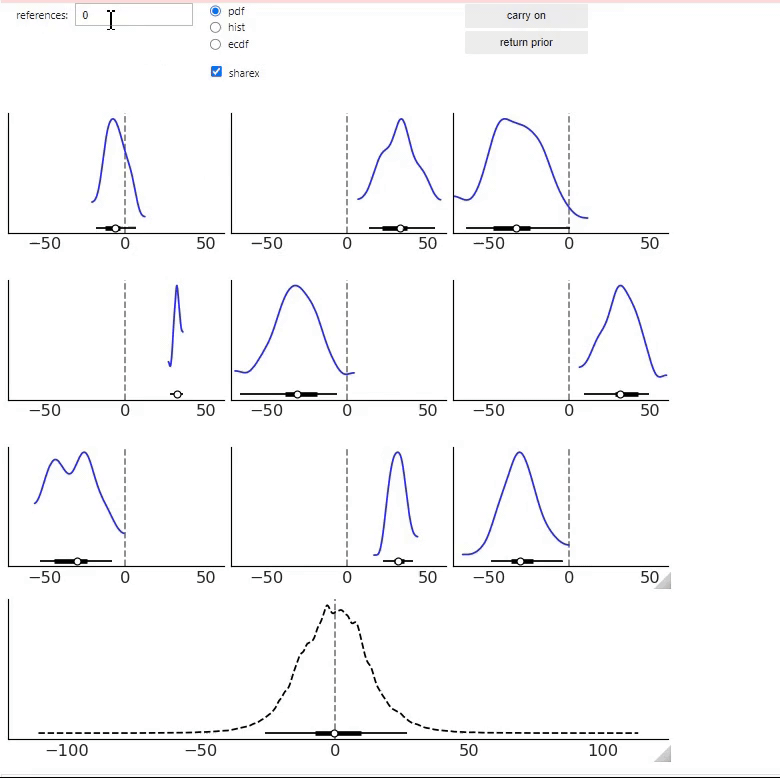

---
jupytext:
  text_representation:
    extension: .md
    format_name: myst
kernelspec:
  display_name: Python 3
  language: python
  name: python3
---

# Prior predictive assistant

Now we will see a very experimental tool called “prior predictive assistant” (ppa for short). Suppose we have a model
and we want to explore the prior predictive distribution and if possible refine the priors in our model. A common
scenario in practice is that after some thinking we are able to define a model, but our priors are still too wide, as we
are underusing our prior knowledge.

```{jupyter-execute}

import preliz as pz
import numpy as np
import pandas as pd
```

```{jupyter-execute}

pz.style.library["preliz-doc"]["figure.dpi"] = 100
pz.style.library["preliz-doc"]["figure.figsize"] = (10, 4)
pz.style.use("preliz-doc")
```

Let's assume a Normal model with an unknown mean and standard deviation, here `a` and `b` represent our priors and `y` the
likelihood.

```{jupyter-execute}

np.random.seed(1237)

def a_preliz_model():
    a = pz.Normal(0, 10).rvs()
    b = pz.HalfNormal(10).rvs()
    y = pz.Normal(a, b).rvs(100)
    return a, b, y
```

```{jupyter-execute}

%matplotlib widget
pz.ppa(a_preliz_model)
```

The `ppa` function will take the function `a_preliz_model` and generate 2000 samples from the prior (`a`, `b`) and
prior_predictive distribution `y`. Then it will automatically select 9 samples from the prior_predictive distribution (
the blue distributions in the 3x3 grid). At the bottom (black dashed line) we have a plot of the 2000 samples
altogether.

Then, from the 3x3 grid, we can select one or more samples that match our domain knowledge. If we click on
the `carry on` button we will get a new set of samples from the prior predictive distribution. The bottom panel will
automatically update to reflect all previously selected samples. Once we have selected a few distributions we click on
the `return prior` button to get a prior that agrees with the selected predictive distributions.

Four important aspects when trying `ppa` is that:

- We want to select distributions based on prior information and NOT based on the observed data we want to fit.

- The more distributions we select the more accurate the results should be.

- The returned prior is just a suggestion, to be sure the suggestion is useful you may want to try `ppa` a couple of
  times and see how variable results are and do further tests like using `predictive_explorer`

- This is experimental, both in the sense the code may have bugs and in the sense that the methodology could be dubious,
  or at least unrefined

A few more details about what is going on under the hood

By default, the first set of samples is selected at random but tries to return a diverse subset. At any point, you can
click on the `carry on` button. Even when we have not selected any distribution, in such a case we will get a new set of
samples and the bottom panel will not be updated, simply because the selected set of distributions remains the same.
After we have selected at least one sample, the following samples that are shown will be chosen to be similar to the
previously selected ones. But if you keep clicking on the `carry on` button, eventually `ppa` is going to return random
samples again. Every time we select a sample, `ppa` will try to select a few more for us, we are not able to directly
see them but they are going to affect the bottom panel, so we can monitor that `ppa` did not select something too far or
different from what we want.

Alternatively to the random initialization, we can provide information to `ppa` about our prior knowledge by passing
the `init` argument. If that's the case, then `ppa` will first show 9 samples to be as close as possible to what is
specified by `init`. Currently, we have two options, pass a PreliZ distribution or a 2-tuple with the first element
representing the mean and the second, the standard deviation. There is also a `boundaries` argument, that we can use to
specify hard lower and/or upper boundaries. Samples with values outside these boundaries will not be available for
selection, either by the user or `ppa`. Essentially, those samples will be discarded.

`ppa` returns two sets of priors:

* One that is restricted to return a prior on the same family as specified in the PreliZ model, in this example the
  prior for `a` will always be `Normal` and the prior for `b`, `HalfNormal`.
* One that can select new families. We are currently exploring how to do this properly and what limitations this has,
  for example, it is expected that we will need to select more distributions to trust these results that the ones with
  the original families. Also we may want to have more control over which other families we want, like explicitly define
  them or add some restrictions like "positive distributions" only.
  
If you are unable to run this notebook, you can get a glimpse of `ppa` from this gif:


