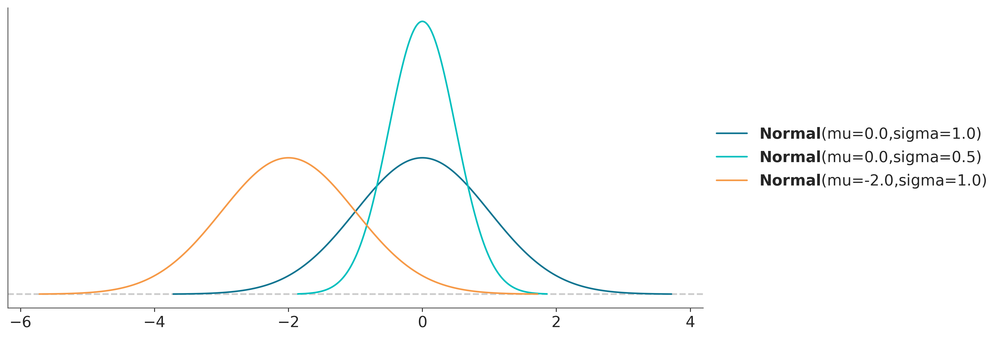
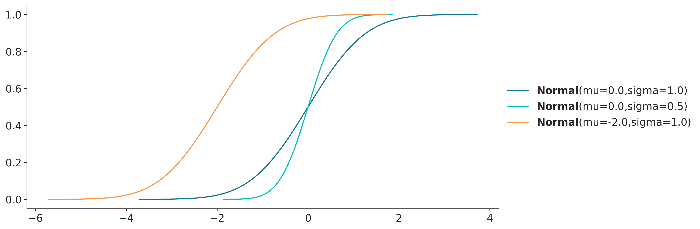

Normal Distribution
===================

The normal distribution, also known as the Gaussian distribution, is a continuous probability distribution characterized by its bell-shaped curve, symmetric around the mean. It is defined by two parameters: the mean (μ) and the standard deviation (σ). The mean determines the center of the distribution, while the standard deviation controls the spread or width of the distribution.

The normal distribution is often the result of summing many small, independent effects, a concept encapsulated by the Central Limit Theorem. Many biological processes exhibit this property, such as human height, blood pressure, and measurement errors. In such cases, numerous genetic, environmental, and random factors contribute to the observed outcome, each adding a small effect. For example, human height is influenced by multiple genes and environmental factors, which together result in a normal distribution of heights across a population.

Normal priors are commonly chosen in Bayesian analysis because they represent a state of limited prior knowledge or weak information. When we assume a parameter has finite variance but lack strong prior knowledge, the normal distribution becomes a suitable choice. This is due to the normal distribution's maximum entropy property among all distributions with a specified mean and variance, ensuring it introduces the least amount of additional assumptions. 

Probability Density Function (PDF):
____________________________________________________

Cumulative Distribution Function (CDF):
____________________________________________________

Key properties and parameters:
____________________________________________________

========  ==========================================
Support   :math:`x \in \mathbb{R}`
Mean      :math:`\mu`
Variance  :math:`\sigma^2`
========  ==========================================

Relevant mathematical formulas:
____________________________________________________

**Probability Density Function (PDF):**

.. math::

    f(x \mid \mu, \sigma) =
    \frac{1}{\sigma \sqrt{2\pi}}
    \exp\left\{ -\frac{1}{2} \left(\frac{x-\mu}{\sigma}\right)^2 \right\}

**Cumulative Distribution Function (CDF):**

.. math::

    F(x \mid \mu, \sigma) =
    \frac{1}{2} \left[ 1 + \text{erf} \left( \frac{x - \mu}{\sigma \sqrt{2}} \right) \right]

where erf is the error function.

See also:
____________________________________________________

- :doc:`Student's T Distribution <students_t_distribution>`

References:
____________________________________________________

- `Wikipedia - Normal distribution <https://en.wikipedia.org/wiki/Normal_distribution>`_