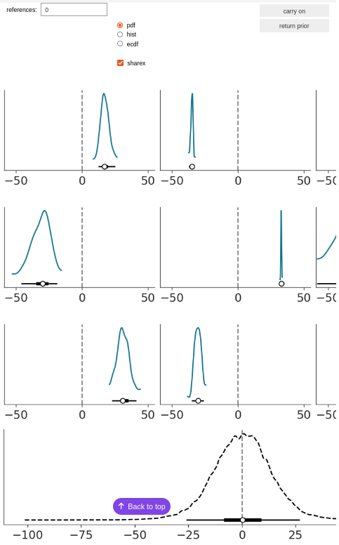
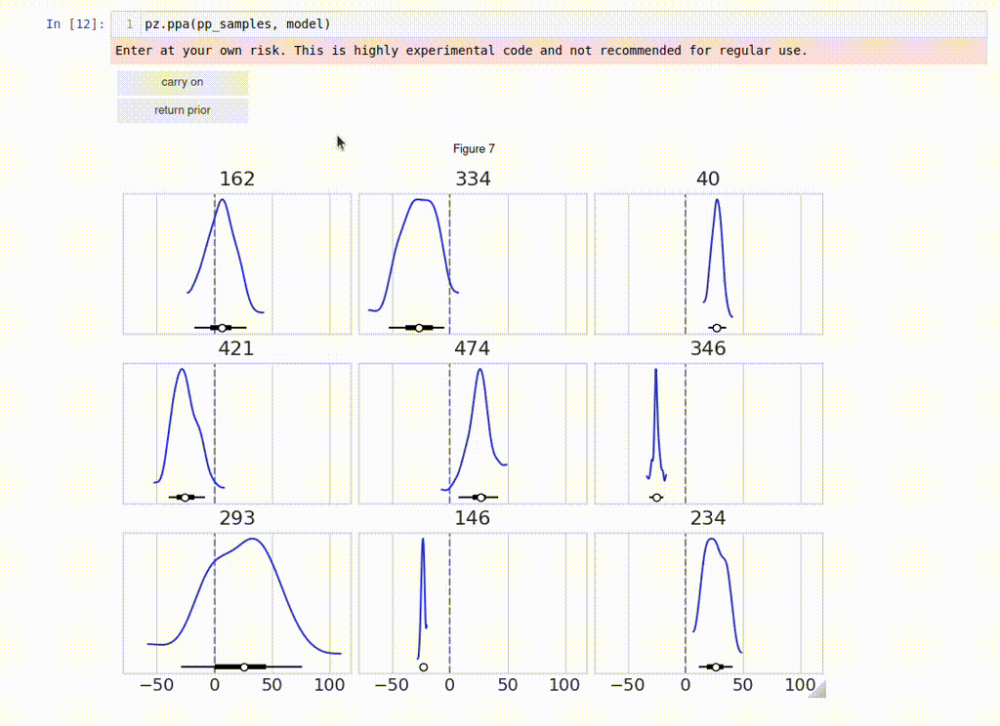

Predictive Elicitation
=======================

.. code-block:: python

    
    import preliz as pz
    import numpy as np
    import pandas as pd

.. code-block:: python

    pz.style.library["preliz-doc"]["figure.dpi"] = 100
    pz.style.library["preliz-doc"]["figure.figsize"] = (10, 4)
    pz.style.use("preliz-doc")

Predictive elicitation refers to the elicitation of priors by making evaluations on the observed space, instead of the parameters space. The advantage of the former is that generally it is easier to think about observations than parameters, specially for domain experts. If you are a forest engineer, you may be more familiar with the expected rate of wildfires in an area than with the ``rho`` parameter of a model.

Currently PreliZ provides 3 functions for predictive elicitation. Most of the future development of PreliZ will be focused on improving these tools and providing other tools for predictive elicitation.

Predictive explorer
-------------------
This function will automatically generate textboxes for a function, which makes it easier to explore how the prior predictive distribution changes when we change the priors. This function supports **PreliZ**, **PyMC** and **Bambi** Models.

.. tabs::

    .. tab:: PreliZ

        Suppose you already have a model, but you are unsure about the implications of its parameters. You can write it using PreliZ distributions and put it inside a function with the arguments being the parameters you want to explore.

        .. code-block:: python

            x = np.linspace(0, 1, 100)
            def a_preliz_model(a_mu, a_sigma, c_sigma=1):
                a = pz.Normal(a_mu, a_sigma).rvs()
                c = pz.Gamma(mu=2, sigma=c_sigma).rvs()
                b = pz.Normal(np.exp(a)*x, c).rvs()
                return b

        By calling predictive_explorer you will get textboxes with some default initial values and for you to explore.

        .. code-block:: python

            pz.predictive_explorer(a_preliz_model)

        .. image:: img/predictive_elicitation/predictive_explorer_preliz_ecdf.png
            :alt: Predictive Explorer ecdf
            :align: center

        After the parameter name, you will see a tuple indicating the valid range of the parameter. These values are inferred automatically by ``predictive_explorer``.

        Currently, we use a very simple heuristic to find the range, so take the suggestion with a pinch of salt
        ``predictive_explorer`` supports three types of plots: empirical cumulative distribution functions (CDFs), kernel density estimations (KDEs), and histograms. Additionally, you can also add custom Matplotlib code using the ``plot_func`` parameter.

        .. code-block:: python

            # Custom function to plot a histogram
            def custom_hist(predictions, ax):
                ax.hist(predictions.flatten(), bins='auto', alpha=0.7)

        .. code-block:: python

            # plot_func set to custom_hist for preliz model
            pz.predictive_explorer(a_preliz_model, samples=10, plot_func=custom_hist)

        .. image:: img/predictive_elicitation/predictive_explorer_preliz_custplot.png
            :alt: Predictive Explorer Custom Plot
            :align: center

    .. tab:: PyMC

        PyMC is an optional dependency of PreliZ, you only need it if you want to use the ``predictive_explorer`` function with PyMC models.

        To install *PyMC*, you can run the following command:

        .. code-block:: bash

            conda install -c conda-forge pymc

        .. code-block:: python

            # Add pymc
            import pymc as pm

        You can write the model using *PyMC* distributions and place it inside the function with the arguments being the parameters you want to explore.

        .. code-block:: python

            x = np.linspace(0, 1, 100)
            def a_pymc_model(a_mu, a_sigma, c_sigma=1):
                with pm.Model() as model:
                    a = pm.Normal("a", a_mu, a_sigma)
                    c = pm.Gamma("c", mu=2, sigma=c_sigma)
                    b = pm.Normal("b", np.exp(a) * x, c, observed=[0] * 100)
                return model

        The ``predictive_explorer`` function auto-detects that the model contains PyMC distributions, alternatively you can specify that the function should use the PyMC engine by providing the parameter ``engine=pymc``.

        .. code-block:: python

            pz.predictive_explorer(a_pymc_model)

        .. image:: img/predictive_elicitation/predictive_explorer_pymc_ecdf.png
            :alt: Predictive Explorer ecdf
            :align: center

        After the parameter name, you will see a tuple indicating the valid range of the parameter. These values are inferred automatically by ``predictive_explorer``.

        Currently, we use a very simple heuristic to find the range, so take the suggestion with a pinch of salt
        ``predictive_explorer`` supports three types of plots: empirical cumulative distribution functions (CDFs), kernel density estimations (KDEs), and histograms. Additionally, you can also add custom Matplotlib code using the ``plot_func`` parameter.

        .. code-block:: python

            # Custom function to plot a histogram
            def custom_hist(predictions, ax):
                ax.hist(predictions.flatten(), bins='auto', alpha=0.7)

        .. code-block:: python

            # plot_func set to custom_hist for pymc model
            pz.predictive_explorer(a_pymc_model, samples=10, plot_func=custom_hist)

        .. image:: img/predictive_elicitation/predictive_explorer_pymc_custplot.png
            :alt: Predictive Explorer Custom Plot
            :align: center

    .. tab:: Bambi

        Bambi is an optional dependency of PreliZ, you only need it if you want to use the ``predictive_explorer`` function with Bambi models.

        To install *Bambi*, you can run the following command:

        .. code-block:: bash

            conda install -c conda-forge bambi

        .. code-block:: python

            # Add bambi
            import bambi as bmb

        The ``predictive_explorer`` function allows you to write the model using *Bambi* distributions and inout it inside the function with the arguments being the parameters you want to explore.

        .. code-block:: python

            data = pd.DataFrame(
            {
                "y": np.random.normal(size=100),
                "x": np.random.normal(size=100),
            }
            )
            def a_bambi_model(a_mu, a_sigma):
                prior = {"Intercept": bmb.Prior("Normal", mu=a_mu, sigma=a_sigma)}
                a_model = bmb.Model("y ~ x", data, priors=prior)
                return a_model

        The ``predictive_explorer`` function automatically detects if the model contains Bambi distributions. Alternatively, you can specify that the function should use the Bambi engine by providing the parameter ``engine=bambi``.

        .. code-block:: python

            pz.predictive_explorer(a_bambi_model)

        .. image:: img/predictive_elicitation/predictive_explorer_bambi_ecdf.png
            :alt: Predictive Explorer ecdf
            :align: center

        After the parameter name, you will see a tuple indicating the valid range of the parameter. These values are inferred automatically by ``predictive_explorer``.

        Currently, we use a very simple heuristic to find the range, so take the suggestion with a pinch of salt
        ``predictive_explorer`` supports three types of plots: empirical cumulative distribution functions (CDFs), kernel density estimations (KDEs), and histograms. Additionally, you can also add custom Matplotlib code using the ``plot_func`` parameter.

        .. code-block:: python

            # Custom function to plot a histogram
            def custom_hist(predictions, ax):
                ax.hist(predictions.flatten(), bins='auto', alpha=0.7)

        .. code-block:: python

            # plot_func set to custom_hist for bambi model
            pz.predictive_explorer(a_bambi_model, samples=10, plot_func=custom_hist)

        .. image:: img/predictive_elicitation/predictive_explorer_bambi_custplot.png
            :alt: Predictive Explorer histogram
            :align: center

Prior predictive assistant
---------------------------
Now we will see a very experimental tool called “prior predictive assistant” (ppa for short). Suppose we have a model and we want to explore the prior predictive distribution and if possible refine the priors in our model. A common scenario in practice is that after some thinking we are able to define a model, but our priors are still too wide, as we are underusing our prior knowledge.

Let assume a Normal model with an unknown mean and standard deviation, here ``a`` and ``b`` represent our priors and ``y`` the likelihood.

.. code-block:: python

    np.random.seed(1237)
    def a_preliz_model():
    a = pz.Normal(0, 10).rvs()
    b = pz.HalfNormal(10).rvs()
    y = pz.Normal(a, b).rvs(100)
    return a, b, y

.. code-block:: python

    %matplotlib widget
    pz.ppa(a_preliz_model)

The ``ppa`` function will take the function ``a_preliz_model`` and generate 2000 samples from the prior (``a``, ``b``) and prior_predictive distribution ``y``. Then it will automatically select 9 samples from the prior_predictive distribution (the blue distributions in the 3x3 grid). At the bottom (black dashed line) we have a plot of the 2000 samples altogether.

Then, from the 3x3 grid, we can select one or more samples that match our domain knowledge. If we click on the ``carry on`` button we will get a new set of samples from the prior predictive distribution. The bottom panel will automatically update to reflect all previously selected samples. Once we have selected a few distributions we click on the ``return prior`` button to get a prior that agrees with the selected predictive distributions.

Four important aspects when trying ``ppa`` is that:

* We want to select distributions based on prior information and NOT based on the observed data we want to fit.

* The more distributions we select the more accurate the results should be.

* The returned prior is just a suggestion, to be sure the suggestion is useful you may want to try ``ppa`` a couple of times and see how variable results are and do further tests like using ``predictive_explorer``

* This is experimental, both in the sense the code may have bugs and in the sense that the methodology could be dubious, or at least unrefined

A few more details about what is going on under the hood

By default, the first set of samples is selected at random but tries to return a diverse subset. At any point, you can click on the ``carry on`` button. Even when we have not selected any distribution, in such a case we will get a new set of samples and the bottom panel will not be updated, simply because the selected set of distributions remains the same. After we have selected at least one sample, the following samples that are shown will be chosen to be similar to the previously selected ones. But if you keep clicking on the ``carry on`` button, eventually ``ppa`` is going to return random samples again. Every time we select a sample, ``ppa`` will try to select a few more for us, we are not able to directly see them but they are going to affect the bottom panel, so we can monitor that ``ppa`` did not select something too far or different from what we want.

Alternatively to the random initialization, we can provide information to ``ppa`` about our prior knowledge by passing the ``init`` argument. If that's the case, then `ppa` will first show 9 samples to be as close as possible to what is specified by ``init``. Currently, we have two options, pass a PreliZ distribution or a 2-tuple with the first element representing the mean and the second, the standard deviation. There is also a ``boundaries`` argument, that we can use to specify hard lower and/or upper boundaries. Samples with values outside these boundaries will not be available for selection, either by the user or ``ppa``. Essentially, those samples will be discarded.

``ppa`` returns two sets of priors:

* One that is restricted to return a prior on the same family as specified in the PreliZ model, in this example the prior for ``a`` will always be ``Normal`` and the prior for ``b``, ``HalfNormal``.
* One that can select new families. We are currently exploring how to do this properly and what limitations this has, for example, it is expected that we will need to select more distributions to trust these results that the ones with the original families. Also we may want to have more control over which other families we want, like explicitly define them or add some restrictions like "positive distributions" only.

If you are unable to run this notebook, you can get a glimpse of ``ppa`` from this gif:

Posterior to Prior
-------------------
Now let's look at another experimental method called “posterior to prior“ (p2p for short). This method fits the posterior distribution derived from the model to align with its prior distribution by maximizing the likelihood of each posterior marginal with respect to the prior.
This method returns a string with the updated priors. It assumes the posterior was originally created using the model. This function works with **PyMC** and **Bambi** models.

.. tabs::

    .. tab:: PyMC
        PyMC is an optional dependency of PreliZ, you will need it if you want to use the ``posterior_to_prior`` function with PyMC models.

        To install *PyMC*, you can run the following command:

        .. code-block:: bash

            conda install -c conda-forge pymc

        .. code-block:: python

            # Add pymc
            import pymc as pm

        You can define the model using PyMC and input the inference data.

        .. code-block::

            data = pz.Normal(0, 1).rvs(200)
            with pm.Model() as model:
                a = pm.Normal("a", mu=0, sigma=1)
                b = pm.HalfNormal("b", sigma=1)
                y = pm.Normal("y", mu=a, sigma=b, observed=data)
                idata = pm.sample(tune=200, draws=500, random_seed=2945)

        The ``posterior_to_prior`` function automatically detects that the model includes PyMC distributions.
        Alternatively, you can explicitly set the function to use the PyMC engine by specifying the ``engine=pymc`` parameter.

        Another parameter you can define is ``alternative``. This parameter enables the model to include both the original distributions and a
        set of predefined alternative distributions.

        When we set ``alternative=None``, no alternative distributions are considered while fitting the model.

        .. code-block::

            >>> pz.posterior_to_prior(model, idata, alternative=None)
            with pm.Model() as model:
                a = pm.Normal("a", mu=-0.0104, sigma=0.0725)
                b = pm.HalfNormal("b", sigma=1.03)

        When we set ``alternative=auto``, most common alternative distributions are considered while fitting the model.

        .. code-block:: bash

            >>> pz.posterior_to_prior(model, idata, alternative="auto")
            with pm.Model() as model:
                a = pm.Normal("a", mu=0.184, sigma=0.0697)
                b = pm.Gamma("b", alpha=423, beta=426)

        We can add a list of distributions to be considered as alternative distributions while fitting the model.

        .. code-block:: bash

            >>> pz.posterior_to_prior(model, idata, alternative=[pz.LogNormal()])
            with pm.Model() as model:
                a = pm.Normal("a", mu=-0.0934, sigma=0.0685)
                b = pm.LogNormal("b", mu=-0.0175, sigma=0.0491)

        We can pass ``alternative`` a dictionary with variable names as keys and lists of PreliZ distributions
        as values to specify different distributions for each variable.

        .. code-block:: bash

            >>> pz.posterior_to_prior(model, idata, alternative={"b": [pz.Gamma(mu=0)]}))
            with pm.Model() as model:
                a = pm.Normal("a", mu=-0.00377, sigma=0.0696)
                b = pm.Gamma("b", mu=1.03, sigma=0.0519)

    .. tab:: Bambi

        Bambi is an optional dependency of PreliZ, you will need it if you want to use the ``posterior_to_prior`` function with Bambi models.

        To install *Bambi*, you can run the following command:

        .. code-block:: bash

            conda install -c conda-forge bambi

        .. code-block:: python

            # Add bambi
            import bambi as bmb

        You can define the model using Bambi and input the inference data.

        .. code-block::

            data = pd.DataFrame(
            {
                "y": np.random.normal(size=117),
                "x": np.random.normal(size=117),
                "x1": np.random.normal(size=117),
            }
            )
            prior = {"Intercept": bmb.Prior("HalfStudentT", nu=1)}
            model = bmb.Model("y ~ x + x1", data, priors=prior)
            idata = model.fit(tune=200, draws=200, random_seed=2945)

        The ``posterior_to_prior`` function can automatically identify if the model uses Bambi distributions.
        If you prefer, you can also explicitly set it to use the Bambi engine by adding the ``engine=bambi`` parameter.

        You can also set the ``alternative`` parameter to include both the original and a set predefined alternative distributions.

        When we set ``alternative=None``, no alternative distributions are considered while fitting the model.

        .. code-block:: bash

            >>> pz.posterior_to_prior(model, idata, alternative=None)
            {"y_sigma" : bmb.Prior("HalfStudentT", nu=351, sigma=0.108), "Intercept" : bmb.Prior("HalfStudentT", nu=351, sigma=0.108), "x" : bmb.Prior("Normal", mu=0.00347, sigma=0.0846), "x1" : bmb.Prior("Normal", mu=0.00347, sigma=0.0846)}

        When we set ``alternative=auto``, most common alternative distributions are considered while fitting the model.

        .. code-block:: bash

            >>> pz.posterior_to_prior(model, idata, alternative="auto")
            {"y_sigma" : bmb.Prior("Gamma", alpha=232, beta=248), "Intercept" : bmb.Prior("Normal", mu=0.0356, sigma=0.0348), "x" : bmb.Prior("Normal", mu=-0.071, sigma=0.0733), "x1" : bmb.Prior("Normal", mu=-0.071, sigma=0.0733)}

        We can add a list of distributions to be considered as alternative distributions while fitting the model.

        .. code-block:: bash

            >>> pz.posterior_to_prior(model, idata, alternative=[pz.LogNormal()])
            {"y_sigma" : bmb.Prior("LogNormal", mu=-0.0384, sigma=0.0667), "Intercept" : bmb.Prior("HalfStudentT", nu=285, sigma=0.979), "x" : bmb.Prior("Normal", mu=0.11, sigma=0.0934), "x1" : bmb.Prior("Normal", mu=0.11, sigma=0.0934)}

        We can pass ``alternative`` a dictionary with variable names as keys and lists of PreliZ distributions
        as values to specify different distributions for each variable.

        .. code-block:: bash

            >>> pz.posterior_to_prior(model, idata, alternative={"Intercept": [pz.Normal(mu=1, sigma=1)]})
            {"y_sigma" : bmb.Prior("HalfStudentT", nu=100, sigma=1.06), "Intercept" : bmb.Prior("Normal", mu=0.084, sigma=0.0628), "x" : bmb.Prior("Normal", mu=0.0444, sigma=0.102), "x1" : bmb.Prior("Normal", mu=0.0444, sigma=0.102)}
