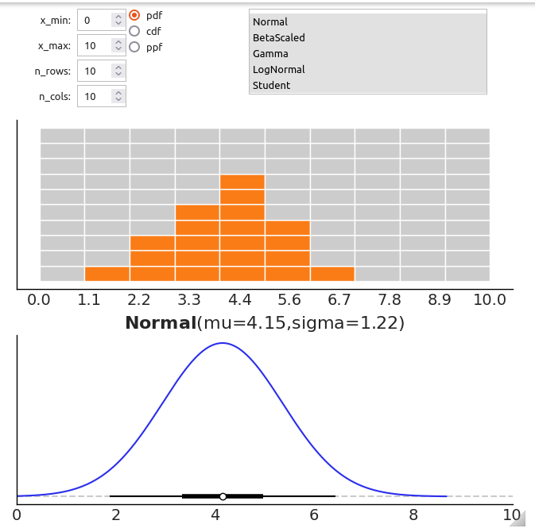

# Summary

In a Bayesian modeling workflow, a prior distribution can be chosen in different ways as long as it captures the uncertainty about model parameters prior to observing any data. Particularly, prior elicitation refers to the process of transforming the knowledge of a particular domain into well-defined probability distributions. Here we introduce PreliZ, a Python package aimed at helping practitioners choose prior distributions.

# Statement of need

Specifying useful priors is a central aspect of Bayesian statistics [@gelman:2013; @martin:2021; @martin:2022], yet prior elicitation techniques that would make this step easier and more systematic are not routinely used within practical Bayesian workflows [@mikkola:2021]. Instead, practitioners tipicaly rely on ad hoc procedures based on a mix of their own experience and recommendations available in the literature, which in general has not been systematized [@sarma:2020]. One reason is that current solutions are simply not sufficient for practical data analysis and do not integrate well with probabilistic programming libraries [@mikkola:2021]. PreliZ is a library for prior elicitation that aims to facilitate the task for practitioners by offering a set of tools for the various facets of prior elicitation. It covers a range of methods, from unidimensional prior elicitation on the parameter space to predictive elicitation on the observed space. The goal is to be compatible with probabilistic programming languages in the Python ecosystem like PyMC and PyStan, which involves including the distributions and their parameterization that are supported by these languages.

# Software API and Features

PreliZ provides functionality for four core aspects: (1) Specification and manipulation of prior distributions, (2) Visualization of priors and the induced predictive distributions, (3) User interaction components, and (4) Algorithms learning priors from user-provided information.
PreliZ distributions are built on top of SciPy distributions, providing easy access to all standard functionality, in particular random sampling and quantiles needed in the elicitation process. However, PreliZ extends many of the distributions for increased user-friendliness. For instance, PreliZ uses a canonical parametrization, instead of loc-scale style used by many of the SciPy distributions, and adds common alternative parametrizations,  e.g. Beta-distribution also in terms of mean and standard deviation. Finally, PreliZ also includes some distributions not available in SciPy, like the HalfStudentT, or LogitNormal.

Preliz provides a range of plotting commands, including probability densities and cumulative densities (`plot_pdf` and `plot_cdf`) as well as extensive numerical summaries covering e.g. equal tailed intervals and highest density intervals. All plots support easy integration of input functionality, with the method `plot_interactive` automatically creating ipywidgets sliders for effortless exploration of how the parameters affect the distribution (see \autoref{fig:figure_1}).

PreliZ includes a few algorithms for inferring the suitable prior from the user-provided information, and provides a general API that makes adding new algorithms easy. As a practical example, `pz.maxent(pz.Gamma(mu=4), 1, 10, 0.9)` would find the maximum-entropy Gamma distribution that has 90% of its mass between 1 and 10, with the additional constraint of mean being 4. The library currently implements also the roulette method of @morris:2014, allowing users to find a prior distribution by drawing a histogram (see \autoref{fig:figure_2}).

One of the main goals of PreliZ is to facilitate predictive elicitation, where information provided in the space of observable quantities is converted into a valid prior by a suitable learning algorithms, avoiding the need to provide direct information on the model parameters. PreliZ already implements functionality for this. For instance, `pz.predictive_sliders` (see \autoref{fig:figure_3}) makes it easy to explore how the prior predictive distribution of an arbitrary probabilistic model changes with the prior, and `pz.ppa` (see \autoref{fig:figure_4}) is an experimental prior predictive assistant that computes priors consistent with user-made choice of prior predictive samples. 

# Software Citations

PreliZ is written in Python 3.8+ and uses the following software packages:

* ArviZ [@kumar:2019]
* ipympl [@jupyter-matplotlib_2019]
* ipywidgets  [@interactive_Jupyter_widgets]
* Matplotlib [@Hunter:2007]
* NumPy [@2020NumPy-Array]
* SciPy [@2020SciPy-NMeth]

# Acknowledgements

We thank our fiscal sponsor NumFOCUS, a nonprofit 501(c)(3) public charity, for their operational and financial support.

This research was supported by:

* the Academy of Finland Flagship Programme "Finnish Center for Artificial Intelligence" (FCAI)
* the National Agency of Scientific and Technological Promotion (ANPCyT), Grant PICT-02212 (O.A.M.)
* the National Scientific and Technical Research Council (CONICET), Grant PIP-0087 (O.A.M).

# References
